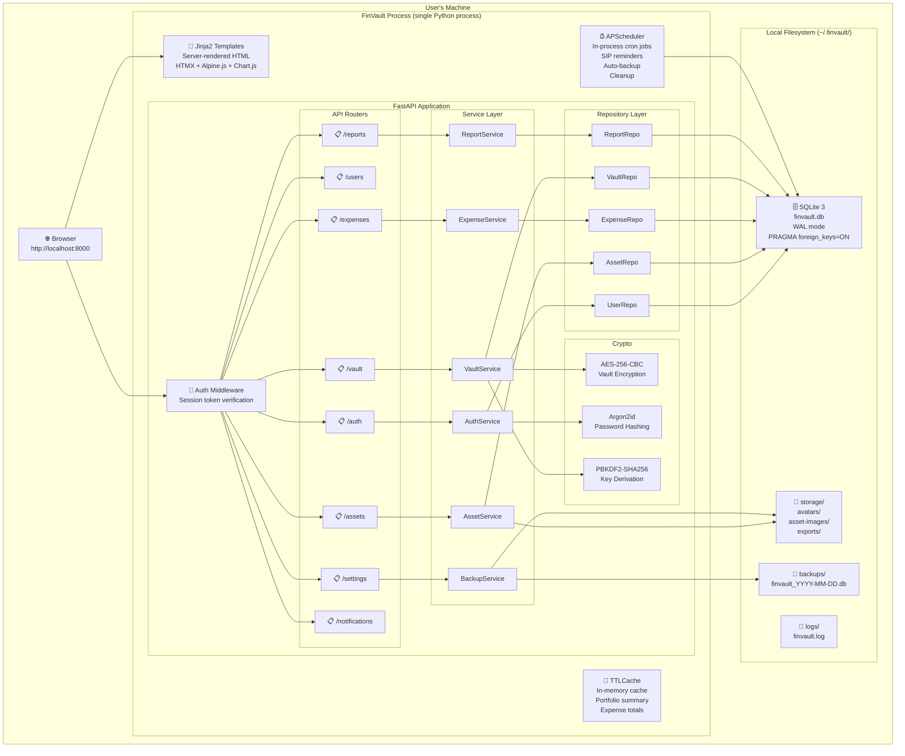
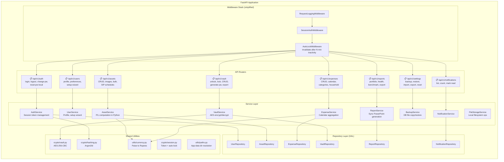
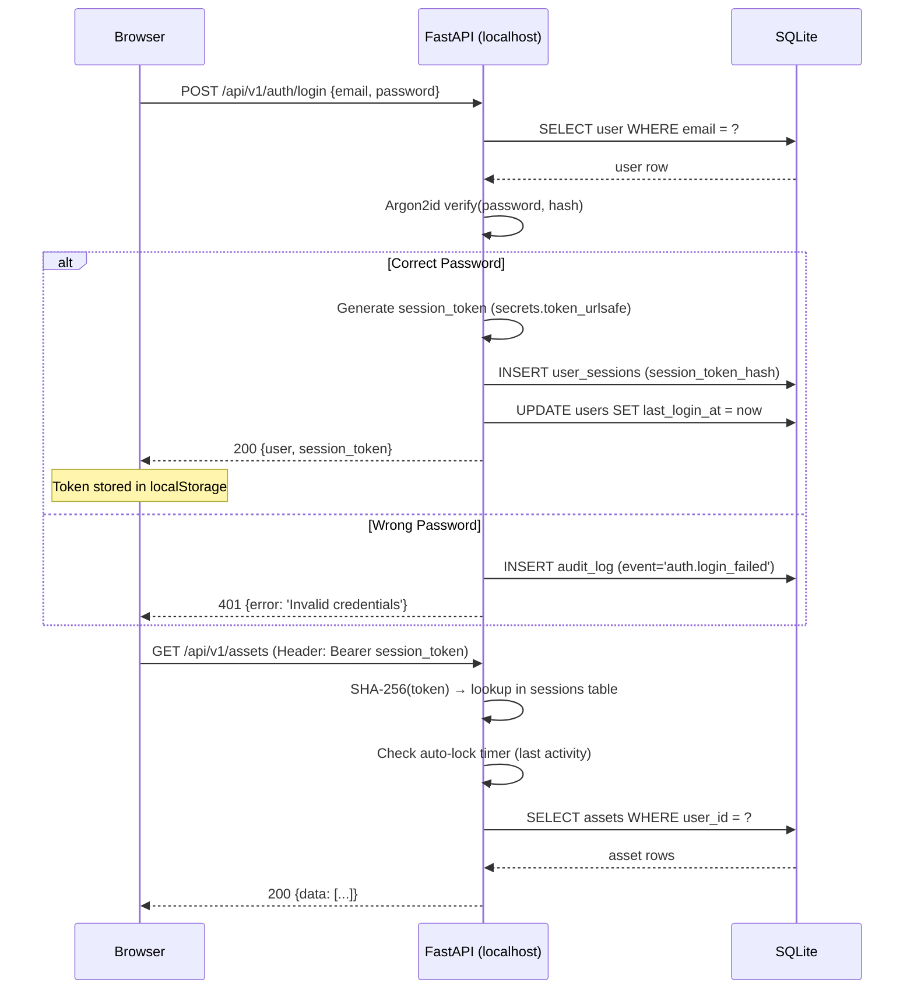
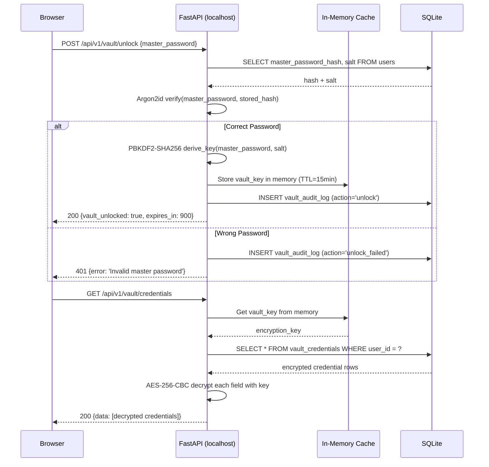
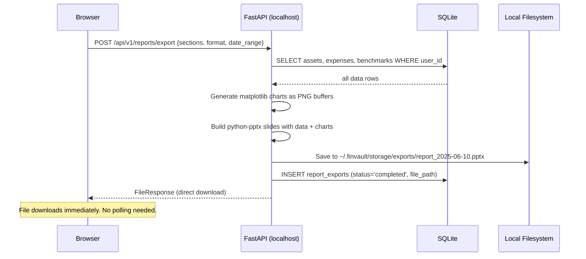
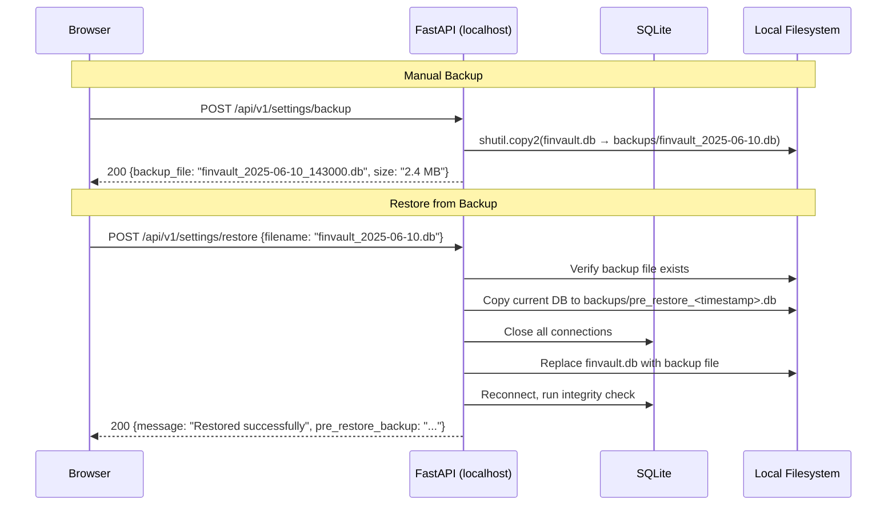
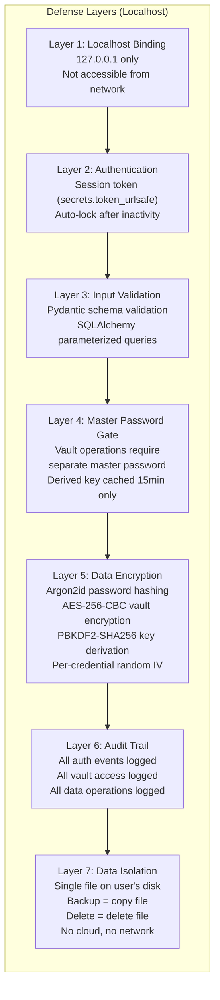
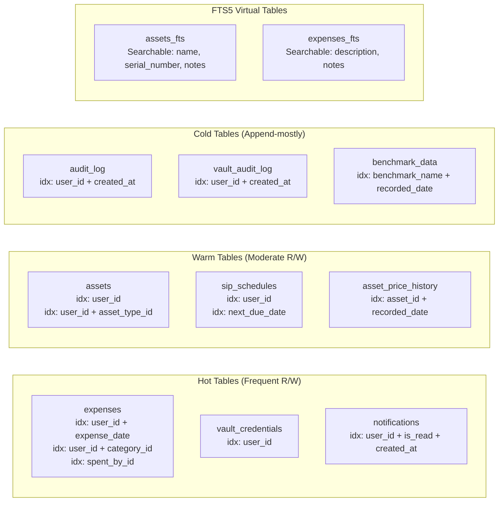
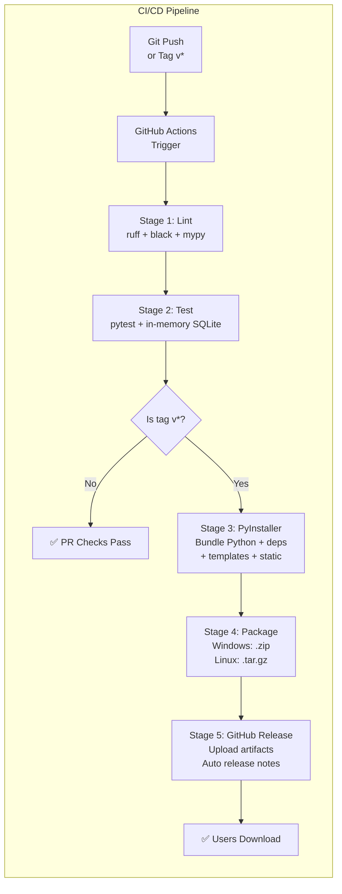

# FinVault — ER Diagram & Architecture (Standalone SQLite)

---

## 1. Entity-Relationship Diagram

```mermaid
erDiagram
    users {
        text id PK "UUID generated in Python"
        text full_name
        text email UK
        text password_hash "Argon2id"
        text phone
        text date_of_birth "ISO date"
        text currency "INR default"
        text avatar_path "Local file path"
        text master_password_hash "Argon2id for vault"
        text master_password_salt "Hex 32-byte salt"
        text security_question "For local password recovery"
        text security_answer_hash "Argon2id hash"
        integer is_setup_complete "0 or 1"
        integer is_active "0 or 1"
        text last_login_at "ISO timestamp"
        text created_at
        text updated_at
    }

    user_sessions {
        text id PK
        text user_id FK
        text session_token_hash "SHA-256"
        text ip_address
        text expires_at
        integer is_revoked "0 or 1"
        text created_at
    }

    user_preferences {
        text id PK
        text user_id FK "one-to-one"
        integer dark_mode "0 or 1"
        text date_format "DD/MM/YYYY"
        text number_format "en-IN"
        integer sip_reminders "0 or 1"
        integer sip_reminder_days "default 3"
        text portfolio_alert_freq "weekly"
        integer benchmark_alerts "0 or 1"
        integer vault_inactivity_reminder "0 or 1"
        integer auto_lock_minutes "default 15"
        text created_at
        text updated_at
    }

    asset_types {
        text id PK "Short IDs: at_mf, at_eq"
        text name UK "Mutual Fund, Equity, etc."
        text slug UK
        text icon
        integer sort_order
        integer is_active "0 or 1"
    }

    assets {
        text id PK
        text user_id FK
        text asset_type_id FK
        text name
        text serial_number
        integer invested_amount "PAISE: 123456 = Rs 1234.56"
        integer current_value "PAISE"
        text purchase_date "ISO date"
        text notes
        integer is_guaranteed "0 or 1"
        real guaranteed_return_pct "8.5 percent"
        text maturity_date
        text created_at
        text updated_at
    }

    asset_images {
        text id PK
        text asset_id FK
        text file_path "Relative to storage dir"
        text file_name
        text mime_type
        integer file_size_bytes
        text created_at
    }

    sip_schedules {
        text id PK
        text asset_id FK
        text user_id FK
        integer amount "PAISE"
        text frequency "monthly or quarterly"
        text start_date
        text end_date "nullable"
        text next_due_date
        text status "active, paused, completed"
        integer auto_update_value "0 or 1"
        text created_at
        text updated_at
    }

    asset_price_history {
        text id PK
        text asset_id FK
        integer value "PAISE"
        text recorded_date
        text source "manual or sip"
        text created_at
    }

    expense_categories {
        text id PK "Short IDs: ec_food, ec_transport"
        text user_id FK "NULL for system defaults"
        text name
        text slug
        text color_hex
        text icon
        integer sort_order
        integer is_active "0 or 1"
        integer is_system "0 or 1"
        text created_at
        text updated_at
    }

    household_members {
        text id PK
        text user_id FK
        text name
        text relationship "Self, Spouse, Parent, Child"
        text avatar_initial
        integer is_active "0 or 1"
        text created_at
        text updated_at
    }

    expenses {
        text id PK
        text user_id FK
        text category_id FK
        text spent_by_id FK "household_members"
        text spent_for_id FK "household_members, nullable"
        text expense_date "ISO date"
        integer amount "PAISE"
        text description
        text notes
        text created_at
        text updated_at
    }

    vault_credential_categories {
        text id PK "Short IDs: vc_social, vc_finance"
        text name "Social, Finance, Work, Shopping, Other"
        text slug
        integer sort_order
    }

    vault_credentials {
        text id PK
        text user_id FK
        text category_id FK "nullable"
        text service_name_enc "AES-256-CBC encrypted"
        text url_enc "AES-256-CBC encrypted"
        text username_enc "AES-256-CBC encrypted"
        text password_enc "AES-256-CBC encrypted"
        text notes_enc "AES-256-CBC encrypted"
        text favicon_url "Not encrypted"
        text last_password_changed
        text created_at
        text updated_at
    }

    vault_audit_log {
        text id PK
        text user_id FK
        text action "unlock, lock, view, copy, create, delete, export"
        text credential_id FK "nullable"
        text ip_address
        text created_at
    }

    notifications {
        text id PK
        text user_id FK
        text type "sip_reminder, portfolio_alert, system"
        text title
        text message
        text icon
        text action_url "nullable"
        integer is_read "0 or 1"
        text read_at
        text created_at
    }

    report_exports {
        text id PK
        text user_id FK
        text format "pptx, csv, json, pdf"
        text status "completed always for standalone"
        text file_path "Relative to exports dir"
        text included_sections "JSON array as text"
        text date_from
        text date_to
        text created_at
    }

    benchmark_data {
        text id PK
        text benchmark_name "Nifty50, Sensex, GoldRate"
        text recorded_date
        real value
        real return_pct
        text period "1M, 3M, 6M, 1Y"
        text created_at
    }

    audit_log {
        text id PK
        text user_id FK "nullable"
        text event_type "auth.login, data.export, etc."
        text entity_type
        text entity_id
        text metadata "JSON as text"
        text created_at
    }

    %% ===== RELATIONSHIPS =====

    users ||--o{ user_sessions : "has many"
    users ||--|| user_preferences : "has one"
    users ||--o{ assets : "owns many"
    users ||--o{ sip_schedules : "configures many"
    users ||--o{ expenses : "logs many"
    users ||--o{ expense_categories : "customizes"
    users ||--o{ household_members : "defines"
    users ||--o{ vault_credentials : "stores many"
    users ||--o{ vault_audit_log : "generates"
    users ||--o{ notifications : "receives"
    users ||--o{ report_exports : "requests"
    users ||--o{ audit_log : "triggers"

    asset_types ||--o{ assets : "classifies"
    assets ||--o{ asset_images : "has many"
    assets ||--o{ sip_schedules : "has SIP"
    assets ||--o{ asset_price_history : "tracks"

    expense_categories ||--o{ expenses : "categorizes"
    household_members ||--o{ expenses : "spent_by"

    vault_credential_categories ||--o{ vault_credentials : "tags"
    vault_credentials ||--o{ vault_audit_log : "audited"
```

---

## 2. Relationship Summary Table

| Parent Table | Child Table | Relationship | FK Column | ON DELETE |
|---|---|---|---|---|
| users | user_sessions | 1:N | user_id | CASCADE |
| users | user_preferences | 1:1 | user_id | CASCADE |
| users | assets | 1:N | user_id | CASCADE |
| users | sip_schedules | 1:N | user_id | CASCADE |
| users | expenses | 1:N | user_id | CASCADE |
| users | expense_categories | 1:N | user_id | SET NULL |
| users | household_members | 1:N | user_id | CASCADE |
| users | vault_credentials | 1:N | user_id | CASCADE |
| users | vault_audit_log | 1:N | user_id | CASCADE |
| users | notifications | 1:N | user_id | CASCADE |
| users | report_exports | 1:N | user_id | CASCADE |
| users | audit_log | 1:N | user_id | SET NULL |
| asset_types | assets | 1:N | asset_type_id | RESTRICT |
| assets | asset_images | 1:N | asset_id | CASCADE |
| assets | sip_schedules | 1:N | asset_id | CASCADE |
| assets | asset_price_history | 1:N | asset_id | CASCADE |
| expense_categories | expenses | 1:N | category_id | RESTRICT |
| household_members | expenses | 1:N | spent_by_id | RESTRICT |
| household_members | expenses | 1:N | spent_for_id | SET NULL |
| vault_credential_categories | vault_credentials | 1:N | category_id | SET NULL |
| vault_credentials | vault_audit_log | 1:N | credential_id | SET NULL |

### Key differences from PostgreSQL version:
- **Removed**: `password_reset_tokens` table (replaced by security question on `users`)
- **Removed**: `background_jobs` table (APScheduler is in-memory, no DB tracking)
- **Changed**: All `uuid` → `text`, all `decimal` → `integer` (paise), all `timestamp` → `text`
- **Total tables**: 18 (was 20)

---

## 3. Standalone Architecture Block Diagram

---

## 4. Application Layer Detail

---

## 5. Data Flow Diagrams

### 5.1 — Authentication Flow (Standalone)

### 5.2 — Vault Unlock & Credential Retrieval (Standalone)

### 5.3 — Report Export Flow (Synchronous)

### 5.4 — Backup & Restore Flow

---

## 6. Security Architecture (Standalone)

---

## 7. Index Strategy (SQLite)

---

## 8. Build & Release Pipeline

